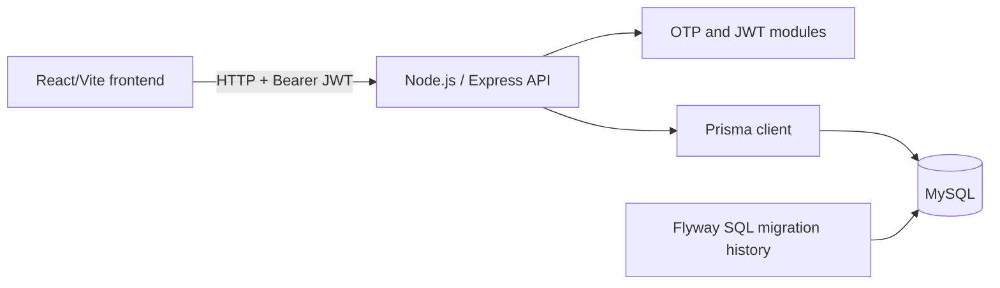

# SarakuSetu Project Overview

## 1. Project Summary

SarakuSetu is a wholesale-commerce project described by the repository as a bridge between wholesalers and retailers. Its implemented product is currently retailer/customer focused: a customer can authenticate by phone OTP, establish a JWT-backed session, and browse an authenticated product catalog. Cart work is in progress.

The intended business model is a shared platform connecting retailers who need products with wholesalers who supply them. Wholesaler and administrator operations are planned, not currently implemented.

## 2. Product Ecosystem

SarakuSetu is intended to be role based, with applications sharing one platform/backend and business rules rather than becoming separate business systems.

| Intended interface | Purpose | Status |
| --- | --- | --- |
| Retailer mobile app / current React frontend | Sign in, browse catalog, and eventually manage cart and orders. | Partially implemented as a React web frontend. |
| Wholesaler mobile experience | Support operational wholesaler workflows. | Planned. |
| Wholesaler web application | Manage catalog, pricing, inventory, orders, retailers, and business information. | Planned. |
| Admin web application | Administer the platform, accounts, access, catalog, orders, and reporting. | Planned. |

## 3. User Roles

### Retailer / customer

**Responsibilities and expected capabilities:** authenticate, browse retailer-visible products, build a cart, place/track orders, and manage their account.

**Status:** customer authentication and catalog browsing are implemented. Cart data/add-item work is in progress. Order, payment, fulfillment, and profile-management workflows are not implemented.

### Wholesaler

**Expected capabilities:** manage a business catalog, pricing, availability/inventory, retailer relationships, and order fulfillment.

**Status:** planned. There is no wholesaler model, authentication flow, API, or frontend in the current repository.

### Admin

**Expected capabilities:** platform administration, account/access management, catalog/order/payment oversight, configuration, and reporting.

**Status:** planned. There is no admin model, API, or frontend in the current repository.

## 4. System Architecture

### Current architecture

- **Frontend:** React 19, TypeScript, and Vite in `frontend/`.
- **Backend:** Node.js, TypeScript, and Express in `backend-node/`.
- **Database:** MySQL, accessed through a shared Prisma client.
- **Schema migration history:** SQL migrations remain under `backend/src/main/resources/db/migration/`; Prisma maps that Flyway-managed schema and is not the migration owner.
- **Authentication:** phone OTP, BCrypt OTP hashes, HS256 JWTs, and Express authentication middleware.
- **Storage/external services:** no object storage, production OTP provider, payment provider, queue, or other external service is configured. Development OTP delivery logs the OTP; non-development delivery is currently a no-op.

### Node.js migration status

The original Spring Boot backend was replaced/retired through the S04 migration work. The active implementation is `backend-node/`. The historical Flyway migration location is retained as the schema source of truth.

## 5. Authentication & Authorization

### Implemented phone OTP flow

1. The client posts a phone number to `POST /api/auth/otp/request`.
2. The backend finds or creates the customer, expires that customer’s active OTPs, generates a cryptographically secure six-digit code, stores only a BCrypt hash, and sets a five-minute expiry.
3. Development delivery logs the OTP; production delivery is intentionally not implemented.
4. The client posts phone number and OTP to `POST /api/auth/otp/verify`.
5. Verification accepts only the newest unverified, unexpired OTP for the phone number; it records failed attempts and locks out after five attempts.
6. On success, the OTP is marked verified and an HS256 JWT is issued with the customer ID as the `sub` claim. The default token TTL is one hour and is configurable by environment.

### Authenticated request context

`requireAuthentication` reads `Authorization: Bearer <token>`, verifies HS256 signature/claims, verifies that `sub` is numeric, and writes `response.locals.customerId` as a `bigint`. Protected routes use this context; they do not take customer identity from request input.

`GET /api/auth/me` uses that ID to load and return the current customer. Missing, malformed, invalid, expired, or unknown-customer access results in `401 { "error": "Unauthorized" }`.

### Authorization / roles

Authentication exists for customers. Role identification and role-specific authorization for retailer, wholesaler, and admin do not exist yet. Current route protection is capability based at the route level, with backend middleware as the security boundary.

### Frontend flow

The React client sends OTP requests/verifications through the shared API helper, stores the returned access token in `localStorage`, uses a Bearer token for authenticated calls, restores a session by requesting `/api/auth/me`, and clears the token/customer state on logout or restoration failure.

## 6. Domain Model

### Implemented entities

| Entity | Purpose and important rules |
| --- | --- |
| `Customer` | Authenticated customer/retailer identity. `phone_number` is unique. |
| `OtpVerification` | OTP hash, phone, expiry, verified state, attempt count, and customer relation. Indexed for customer and active OTP lookup. |
| `Product` | Catalog product with name, optional description/image, `DECIMAL(10,2)` price, active flag, and timestamps. |

### In-progress entities (S03 cart work)

| Entity | Purpose and important rules |
| --- | --- |
| `Cart` | One persistent cart per customer, enforced by unique `customer_id`. |
| `CartItem` | Links a cart to a product with a quantity. `(cart_id, product_id)` is unique; `product_id` is indexed. |

The S03-02 route adds only active products, requires a positive integer quantity, creates a cart when absent, and increments an existing item rather than adding a duplicate row. Cart retrieval, update, and removal are not implemented.

### Not implemented

There are no order, payment, inventory, wholesaler, administrator, category, or notification domain models in the repository.

## 7. Sprint History

Git history is the source for completed entries. S03 entries are current uncommitted work and are therefore not marked complete.

| Sprint / item | Status supported by repository | Delivered scope |
| --- | --- | --- |
| S00-01 | Completed | React frontend project initialization. |
| S00-02 | Not evidenced | No branch, commit, or repository reference with this ID was found. |
| S00-03 | Not evidenced | No branch, commit, or repository reference with this ID was found. |
| S01-01 | Completed | Customer authentication foundation. |
| S01-02 | Completed | Phone OTP authentication. |
| S01-03 | Completed | JWT customer authentication/session support. |
| S01-04 | Completed | Frontend customer authentication experience. |
| S02-01 | Completed | Product catalog foundation. |
| S02-02 | Completed | Product catalog seed data. |
| S02-03 | Completed | Product catalog API. |
| S02-04 | Completed | Product catalog frontend. |
| S03-01 | In progress | Cart/cart-item data model in an uncommitted V5 migration and Prisma schema mapping. |
| S03-02 | In progress | Authenticated add-product-to-cart route and focused tests in the working tree. |
| S04 | Completed | Node.js migration stages: MySQL/Prisma integration, health endpoint, authentication/JWT work, products, frontend API switch, and Spring retirement. Exact issue-level completion is represented by the migration commits, not all individual issue IDs. |

## 8. Current Development Status

### Complete

- Node/Express backend and Prisma/MySQL integration.
- Customer phone-OTP authentication, JWT-based session restoration, and protected route middleware.
- Health endpoint.
- Authenticated active-product catalog API and React catalog UI.
- Frontend configuration defaults to the Node backend URL (`http://localhost:3000`) with a Vite environment override.

### Currently being developed

- S03 cart work: schema/data-model foundation and authenticated add-item flow exist in the working tree but are not committed.

### Next planned capability

- Cart retrieval, then quantity update and item removal are the explicitly named follow-on cart stories. No order/payment sprint plan is present in the repository.

## 9. API / Backend Structure

### Route layout

- `src/routes/index.ts` registers top-level route modules.
- `src/routes/auth/otp.ts` contains OTP request/verify handlers.
- `src/routes/auth/me.ts` contains the authenticated-customer handler.
- `src/routes/health.ts` contains the health endpoint.
- `src/routes/products.ts` contains catalog listing.
- `src/routes/cart.ts` is current S03 work for `POST /api/cart/items`.

### Current API surface

| Method | Path | Auth | Status |
| --- | --- | --- | --- |
| GET | `/api/health` | No | Implemented; reports application/database availability. |
| POST | `/api/auth/otp/request` | No | Implemented. |
| POST | `/api/auth/otp/verify` | No | Implemented; returns a JWT on success. |
| GET | `/api/auth/me` | Yes | Implemented. |
| GET | `/api/products` | Yes | Implemented; active products ordered by name. |
| POST | `/api/cart/items` | Yes | In progress (S03-02). |

### Conventions

- Routes are Express routers/factories with optional Prisma dependency injection for unit tests.
- Small route handlers query Prisma directly when a separate service is not warranted.
- OTP business logic lives in a focused module because it spans generation, hashing, delivery, and transactions.
- `zod` validates environment configuration; route input validation is currently local, explicit TypeScript guards.
- Expected client errors use simple JSON bodies such as `{ "message": "..." }`; unauthorized responses use `{ "error": "Unauthorized" }`.
- Unexpected errors are forwarded to the shared error handler, which returns `500 { "error": "Internal Server Error" }`.

## 10. Frontend Structure

- `src/main.tsx` starts the React application.
- `src/App.tsx` currently contains the primary login/dashboard presentation and product-catalog navigation state.
- `src/api/client.ts` is the shared fetch helper; it derives the API base URL from `VITE_API_BASE_URL`, defaulting to `http://localhost:3000`.
- `src/auth/` contains token storage, OTP API wrappers, types, React context, and the auth hook.
- `src/pages/ProductCatalog.tsx` fetches authenticated products and handles loading, empty, and error states.

The current product “Add to order” control is presentation-only; it is not connected to the in-progress cart endpoint. There is no cart page, product-detail page, order UI, wholesaler UI, or admin UI.

## 11. Database

### Technology and ownership

MySQL is the database. Prisma models reside in `backend-node/prisma/schema.prisma`, but the schema is Flyway-managed. Prisma migration, `db push`, reset, and seed commands are explicitly disallowed by the backend documentation.

### Migration organization

Migrations are SQL files in `backend/src/main/resources/db/migration/`:

| Migration | Status | Purpose |
| --- | --- | --- |
| V1 | Applied historical migration | Creates `customers`. |
| V2 | Applied historical migration | Creates `otp_verifications` and OTP lookup indexes. |
| V3 | Applied historical migration | Creates `products`. |
| V4 | Applied historical migration | Seeds three catalog products. |
| V5 | In-progress working-tree migration | Creates `carts`, `cart_items`, uniqueness constraints, foreign keys, and a product index. |

### Important constraints and relationships

- Customer phone number is unique.
- OTP verification belongs to a customer.
- Products have a precise `DECIMAL(10,2)` price and active flag.
- A cart belongs to one customer and is unique per customer.
- Cart items belong to a cart and product; duplicate product rows in a cart are prevented by a compound unique constraint.

## 12. Engineering Conventions

- **Language/runtime:** TypeScript; Node backend uses ESM and strict TypeScript options.
- **Naming/folders:** kebab-case filenames, route modules in `src/routes`, cross-cutting middleware in `src/middleware`, auth domain logic in `src/modules/auth`, and database utilities in `src/database`.
- **Database access:** one shared Prisma client with environment-sensitive logs; no repository layer that simply wraps Prisma.
- **Validation:** environment variables are parsed with Zod; route handlers use explicit guards for current request shapes.
- **Authentication:** protected routes use `requireAuthentication`; customer identity comes from verified JWT subject only.
- **Responses:** JSON; BigInt serialization is handled explicitly where exposed (`/api/auth/me` and cart item IDs use strings, while product IDs currently use numbers to preserve catalog compatibility).
- **Tests:** Vitest unit tests mock focused Prisma-like clients and route dependencies; no live MySQL test infrastructure is configured.
- **Quality checks:** backend scripts include `lint`, `test`, and `build`; frontend scripts include `lint` and `build` but no test script.
- **Environment:** `.env` files are ignored; `.env.example` documents required placeholders. Frontend public configuration uses `VITE_` variables.
- **Git workflow:** historical work is organized by `feature/Sxx-...` branches and merge commits. Current S03 changes are uncommitted on `feature/s03-cart`.

## 13. Important Architectural Decisions

### Established by implementation

- Node.js/TypeScript/Express is the active backend following Spring Boot retirement.
- Prisma is a runtime ORM/mapping client, not schema-migration owner; Flyway SQL history remains authoritative.
- Authentication is phone OTP plus HS256 JWT, with backend route middleware enforcing protected access.
- The architecture favors focused route handlers and direct Prisma queries over ceremonial repositories/services.
- Product catalog visibility currently relies on product `active` status.

### Proposed direction

- Keep a clean, maintainable, capability-based backend rather than separate backends for every planned app.
- Add role-based access as wholesaler/admin capabilities are introduced.
- Prefer a simple, cost-conscious deployment/infrastructure model and avoid premature distributed systems.

## 14. Infrastructure & Deployment

No deployment, CI/CD, container, cloud, managed database, monitoring, or infrastructure-as-code configuration is present in the repository.

Current local runtime expectations are Node.js 22+, a configured MySQL `DATABASE_URL`, and JWT configuration. The Node API defaults to port 3000; the frontend defaults to that URL through `VITE_API_BASE_URL`.

No further deployment direction is established in current documentation.

## 15. Testing

The backend uses Vitest. Current focused unit tests cover:

- Application bootstrap and health behavior.
- Prisma database availability helper.
- OTP customer creation/request, hash-related interactions, verification outcomes, and attempt handling.
- JWT creation/verification behavior.
- Authentication-dependent `/api/auth/me` behavior.
- Active product list query/serialization/error forwarding.
- In-progress cart add-item validation and upsert/increment intent.

Tests use mocks rather than a live MySQL instance. The frontend has lint/build scripts but no configured test script.

## 16. Known Gaps / Technical Debt

Repository-observed gaps:

- `backend-node/README.md` still says JWT validation middleware and `/api/auth/me` are deferred, but those modules now exist. The README needs updating.
- The current cart add-item route relies on Prisma upserts with MySQL; concurrent first-time creations may need bounded `P2002` retry handling. This is identified in the S03-02 review and is not yet resolved.
- Cart quantity validation accepts JavaScript safe integers beyond MySQL signed `INT` range; a maximum needs to be decided/enforced.
- Cart V5 migration and S03 cart route/tests are uncommitted current work.
- The frontend `Product` type marks `description` as required and `imageUrl` as optional, while the API allows both fields to be `null`.
- Product IDs are serialized as JavaScript numbers, which cannot represent every MySQL `BIGINT` safely; customer/cart IDs use strings in some APIs. A project-wide ID serialization policy is not yet established.
- There is no production OTP provider; production delivery is a no-op.
- There is no role model, wholesaler/admin domain, order/payment domain, or deployment/observability configuration.

## 17. Future Direction

Known next direction is the remaining cart work: retrieve a cart, update quantities, and remove items. Beyond that, the repository and product requirements identify future order, payment, fulfillment, wholesaler, admin, notification, inventory, and role-based access capabilities, but they do not define implementation sequence or sprint IDs.

## 18. Source of Truth

The repository implementation, schema migrations, and Git history are the source of truth for SarakuSetu’s current state. This document should be updated whenever a major architecture, API, data-model, sprint-status, or product decision changes.
